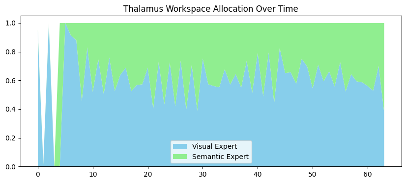

# **Thalamus** 🧠

**Thalamus** is a modular neural architecture that evolves State Space Models (SSMs) from single-vector linear compression to **distributed, specialized state streams**.

Inspired by **Global Workspace Theory (GWT)** and the biological thalamus—the brain's central relay station—this project implements a "Mixture of States" approach using **Mamba** as its core engine.

---

## **The Core Concept**

Current SSMs (like Mamba or S4) compress all historical information into a single hidden state vector. While efficient, this creates a **bottleneck**: semantic concepts, visual patterns, and factual data must all compete for the same dimensions.

**Thalamus** solves this by breaking the state apart into specialized, parallel modules:

1. **Distributed Representation:** Different modules handle different types of data (e.g., a "Visual" module for signal tracking, a "Semantic" module for logic and counting).
2. **The Global Workspace:** A central bottleneck where modules compete to broadcast their most relevant information.
3. **Cross-Module Feedback:** The "winning" information from the workspace is fed back into all modules at the next timestep, allowing the "Visual" stream to influence the "Semantic" stream without quadratic attention costs.

---

## **Key Features**

* **Interference Reduction:** New information in one module is less likely to overwrite critical patterns in another.
* **Linear Efficiency:** Maintains the  complexity of SSMs while increasing total state capacity.
* **Cognitive Plausibility:** Mimics the modular nature of the human cortex and the routing function of the thalamus.
* **Built on Mamba:** Utilizes official `mamba-ssm` CUDA kernels for high-performance state updates.

---

## **Architecture Overview**

```text
Input (t) 
   │
   ▼
┌─────────────────────────────────────────┐
│        The Global Workspace (t-1)       │──┐ (Feedback Loop)
└─────────────────────────────────────────┘  │
   │                                         │
   ▼                                         │
┌───────────────────┬───────────────────┐    │
│  Visual Module    │  Semantic Module  │◄───┘
│  (Fast Decay)     │  (Slow Decay)     │
└─────────┬─────────┴─────────┬─────────┘
          │                   │
          └───► Gating ◄──────┘
                (Softmax)
                  │
                  ▼
┌─────────────────────────────────────────┐
│        The Global Workspace (t)         │
└─────────────────────────────────────────┘
                  │
                  ▼
             Output (t)

```

---

## **Installation**

Thalamus requires a GPU (NVIDIA T4, A100, or H100) to run the Mamba kernels.

```bash
# Install core dependencies
pip install torch causal-conv1d>=1.2.0 mamba-ssm

```

---

## **Quick Start**

To initialize a Thalamus model with two specialized streams:

```python
from thalamus import DistributedMamba

# Initialize model
# input_dim: 2 (e.g., 1 visual channel, 1 text channel)
# workspace_dim: 32 (the size of the "conscious" bottleneck)
model = DistributedMamba(input_dim=2, workspace_dim=32).to("cuda")

# Process a multi-modal sequence
# x shape: [batch, seq_len, features]
output, weights = model(input_tensor)

```



---

## **Research Roadmap**

* [ ] **Multi-Rate Clocking:** Allow the Semantic module to run at a lower frequency than the Visual module to save compute.
* [ ] **Pre-trained Integration:** Use `Mamba-130M` as a backbone for the Semantic module.
* [ ] **Episodic Memory:** Add a Long-Term Memory (LTM) module based on KV-cache or external vector storage.
* [ ] **Hierarchical Routing:** Implement multiple levels of workspaces for "Internal Monologue" reasoning.

---

## **Why "Thalamus"?**

In human anatomy, the **thalamus** is the gateway to the cortex. It doesn't just pass signals through; it filters, prioritizes, and routes information based on what the brain is currently focused on. **Project Thalamus** aims to bring that same level of sophisticated, dynamic routing to the next generation of State Space Models.

---